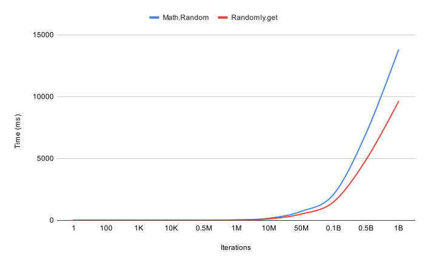

# Randomly
A utility for generating lots of random numbers without being too tasking on the browser. Randomly accomplishes this by generating a set of random numbers on a given interval.

Subsequent requests for random numbers are served from the generated set instead of calling `Math.random`. In addition to getting random numbers, some useful methods have also been added around random numbers.

### Motivation

Working on several generative art projects inspired the need for a common utility which would handle very frequent calls to `Math.random` as well as other provided methods which involve using random numbers.

### Benchmarks

Why not just use `Math.random`? Depending on how many numbers are being generated `Randomly` tends to be more performant as frequency increases. The following chart shows their comparison. You can view how this was measured in the `benchmark.ts` file.



## Usage

```ts
import Randomly from '@ededejr/randomly';

const randomly = new Randomly();
```

#### Getting a random number
```ts
randomly.get() // Returns a number between 0 and 1
```

#### Compare a random number using a predicate
```ts
randomly.compare(value => Math.floor(value * 1000) > 500);
```

#### Check if a random number is less than a threshold
```ts
randomly.lt(0.2); 
```

#### Check if a random number is greater than a threshold
```ts
randomly.gt(0.2); 
```

#### Check if a random number is between an upper and lower bound
```ts
randomly.between(0.2, 0.6); 
```

#### Decide between two values
```ts
randomly.decide('Option A', 'Option B'); 
```

#### Get a Radom number between 0 and a given value
```ts
randomly.sample(100); 
```

#### Controlling the timer
If you would like to pause the interval:
```ts
randomly.stopTimer(); 
```
Starting it up again:
```ts
randomly.startTimer(); 
```

#### Customizing the interval or store size
```ts
import Randomly from '@ededejr/randomly';

const randomly = new Randomly({
    refreshInterval: 5000, // refresh random number store every 5 seconds
    storeSize: 100 // keep a store of a 100 random numbers
});
```

## Developing

### Conventional Commits

Commits should use the format `<type>(scope): message`. The default preset is using "angular" conventions.

`<type>` must be one of the following:

* build: Changes that affect the build system or external dependencies (example * scopes: gulp, broccoli, npm)
* ci: Changes to our CI configuration files and scripts (example scopes: Travis, * Circle, BrowserStack, SauceLabs)
* docs: Documentation only changes
* feat: A new feature
* fix: A bug fix
* perf: A code change that improves performance
* refactor: A code change that neither fixes a bug nor adds a feature
* style: Changes that do not affect the meaning of the code (white-space, * formatting, missing semi-colons, etc)
* test: Adding missing tests or correcting existing tests
